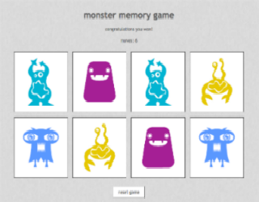

# Monster Memory Game

## Overview
* A memory concentration game built using jQuery where you must flip over tiles to make a match. Flip two tiles over to see if they are a match. If not, the tiles will flip back over, but if you got a match then they stay! Try to match all the pairs!

### Technologies, frameworks, & programming Languages used
* HTML5 & CSS3
* JavaScript
* jQuery
* Lodash

### Url to live demo

[Check it out](http://danielmemorygame.surge.sh/)
